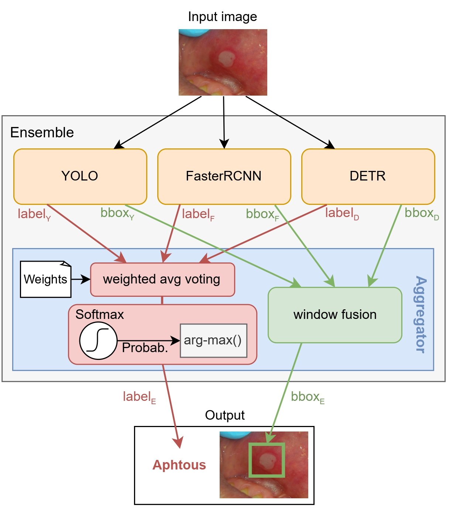
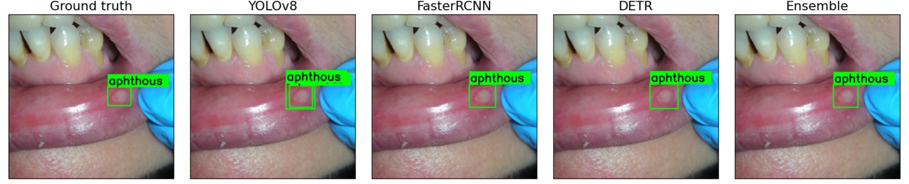
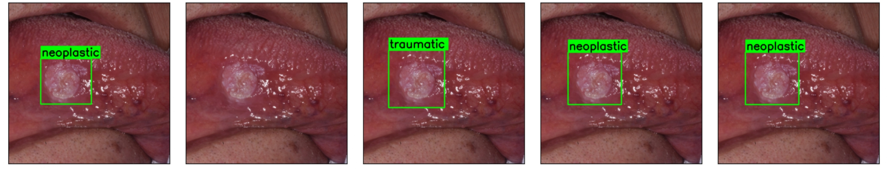

# **Detection framework**


[]()
[]()
[]()
[]()


The project concerns the development of an object detection ensemble architecture presented at [IEEE SSCI-2023](https://attend.ieee.org/ssci-2023/).
A python wrapping framework for performing object detection tasks using state-of-the-art deep learning architecture: YOLOv7, Faster R-CNN, DEtection TRansformer DE-TR.




The architecture was tested on an oral cancer dataset, below are some examples of predictions




## **Installation**

To install the framework, simply clone the repository and install the necessary dependencies:
```sh
git clone https://github.com/MarcoParola/detection_framework.git
cd detection_framework
mkdir models data data/orig data/yolo data/coco

#TODO quando scarichi il file json, rinominalo con "coco_dataset.json"
```

create and activate virtual environment, then install dependencies. 
```sh
python -m venv env
. env/bin/activate
python -m pip install -r requirements.txt 
python -m pip install 'git+https://github.com/facebookresearch/detectron2.git'
```

download zip file containing images (oral1.zip) and coco dataset (oral1.json) and put cocodataset in `./data/`.


## **Usage**

### **Data preparation**
Since this framework relies on different models, different data formats are needed. 
During the project installation, 3 subfolders are created in data: orig, yolo and coco. 
The basic idea is to put your dataset-images in the orig folder; then generate your yolo/coco dataset by using some preprocessing-converter scripts. Please note: if your data doesn't required any preprocessing, you can skip this step, and directily put your data in yolo or coco folder.

```sh
sh scripts/sh/preprocessing.sh
python -m scripts.py.preprocessing.resize_image preproc.img_size.width=640 preproc.img_size.height=640
```


### **fine-tune a model**
The basic command to find-tune a model is the following

> python train.py model=*model_name* dataset=*dataset_type* 

Where ``model`` can assume the following value: 
* yolo
* fasterRCNN
* detr

while ``dataset`` can assume "coco" or "yolo"


The default folder for the images is ``./data/images/``, if you want put your file in a different folder, override the ``datasets.img_path`` argument:

> python train.py model=fasterRCNN dataset=coco.json datasets.img_path=**new_img_path**

To specify the name with which to save the model after fine tuning you can use the ``model_name`` argument:

> python train.py model=fasterRCNN dataset=coco.json model_name=**name**

# TODO

- sposta manualmente il modello post fine allenamento
- cambia il salvataggio di yolo (viene salvato nella root)
- commenta 3 righe di detr in caso di errore
- cambia parametro fasterRCNN per stampare map50 o map50-95, Questa riga https://github.com/facebookresearch/detectron2/blob/main/detectron2/evaluation/coco_evaluation.py?plain=1#L370, se la lasci normale calcola 50_95, se la cambi con precisions[0, :, idx, 0, -1] calcola 0.50
- riduci il batch in caso in cui non hai abbastanza memoria in gpu
- conversione etichette nel dataset (forse l'avevo fatto?)
- per testare yolo, sposta il file dei pesi in ./detection_framework\outputs\yolo\model_outputs\train\weights
- pip freeze, 3 librerie di torch non funzionano
- se non funziona cuda: pip install torch==2.0.0+cu117 torchvision==0.15.1+cu117 torchaudio==2.0.1 --index-url https://download.pytorch.org/whl/cu117
- ho aggiunto una funzione 'get_predictions' in C:\Users\marco\OneDrive\Documenti\uni\detection_framework\models\detr\prediction.py, NB includilo tra le import
- se ci sono problemi con ultralytics: pip install -U ultralytics

